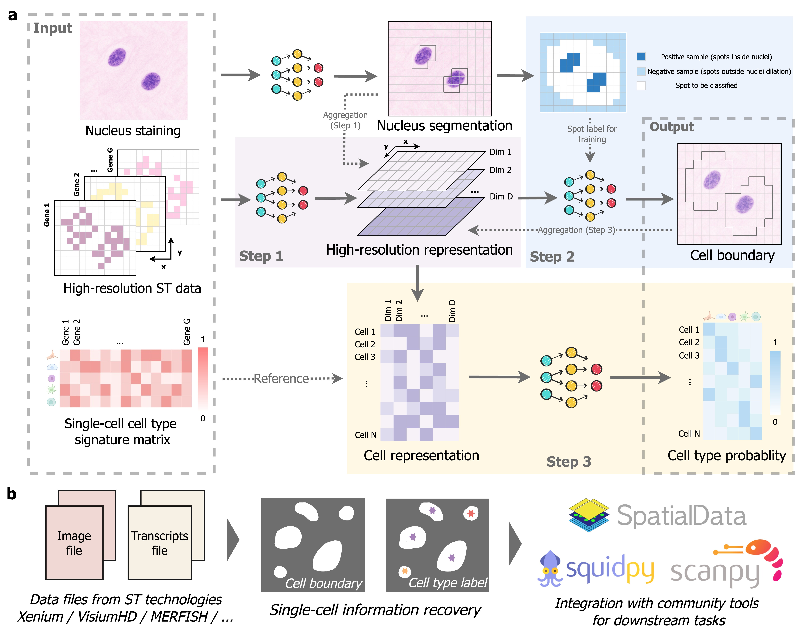

CellART
===================================

CellART is a unified framework for extracting single-cell information from high-resolution ST data. The
primary objectives are to accurately delineate boundaries for individual cells and further annotate their
cell types.  By integrating deep neural networks with probabilistic models, CellART leverages multimodal data, including
spatial transcriptomics, staining images, and scRNA-seq references, to perform simultaneous cell segmentation and cell type annotation, thereby optimizing the analytical process.

.. note::

   This project is under active development.

CellART Manuscript
------------------

coming soon...

CellART Installation & Usage & Demo
------------------

.. toctree::
   :maxdepth: 2

   installation 
   usage
   tutorials/visiumhd_crc
   tutorials/xenium_crc